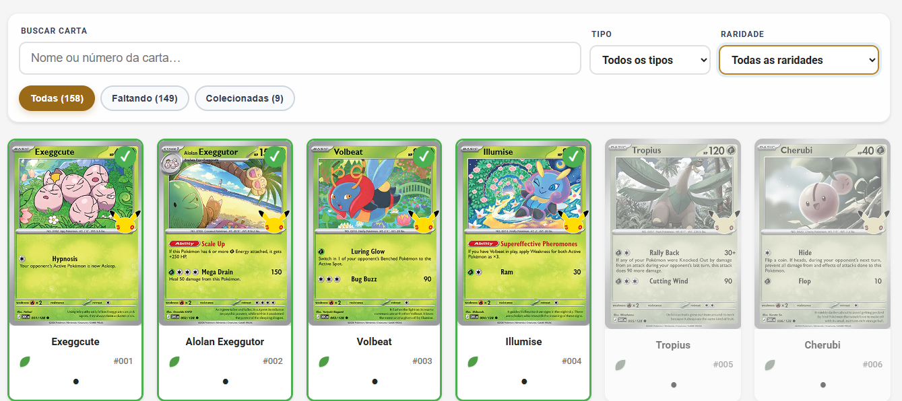

# PokeList

Uma checklist pessoal para acompanhar sua coleção de cartas **Pokémon TCG**.

O projeto permite visualizar cartas de diferentes coleções, pesquisar por nome ou número, filtrar por tipo e raridade e marcar as cartas que já fazem parte da sua coleção.

> **Projeto em evolução:** novas coleções serão adicionadas futuramente para ampliar a checklist e permitir o acompanhamento de uma coleção cada vez maior.

## Prévia



## Tecnologias utilizadas

- **HTML5** — estrutura da aplicação;
- **CSS3** — estilos, responsividade e temas visuais;
- **JavaScript** — lógica da aplicação, filtros e renderização dinâmica;
- **Python** — servidor HTTP local para disponibilizar os arquivos;
- **TCGdex API** — fonte pública dos dados das coleções e cartas;
- **LocalStorage** — armazenamento local do cache e do progresso da coleção.

## Como executar o projeto

### Pré-requisitos

É necessário ter o **Python 3** instalado.

### Execução local

Clone o repositório:

```bash
git clone https://github.com/bruxa61/PokeList.git
cd PokeList
```

Inicie o servidor local:

```bash
python3 server.py
```

Depois, acesse no navegador:

```text
http://localhost:5000
```

O arquivo `server.py` utiliza o servidor HTTP nativo do Python e serve os arquivos estáticos do projeto.
